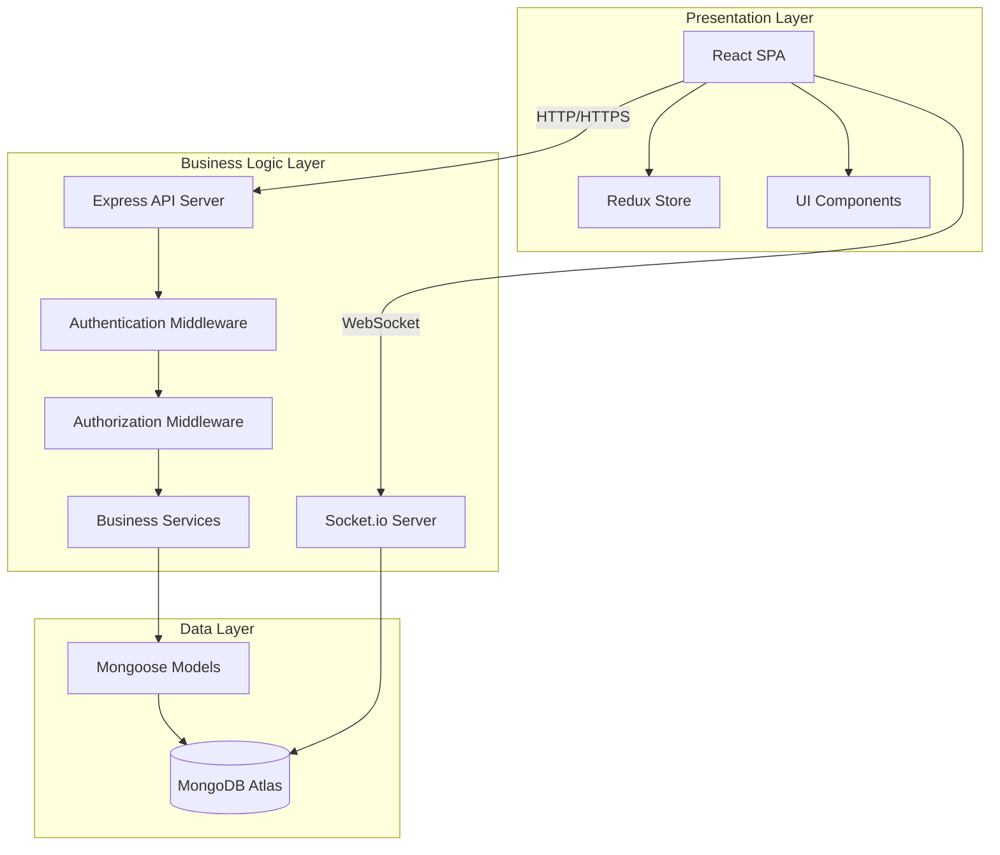

# Design Document: Ethiopian Secondary School Management System

## Overview

The Ethiopian Secondary School Management System (ESSMS) is a comprehensive enterprise-level school management platform built using the MERN stack (MongoDB, Express.js, React.js, Node.js). The system implements a three-tier architecture with clear separation between presentation, business logic, and data layers.

The system serves 11 distinct user roles with role-based access control enforced at every layer. It manages the complete student lifecycle from admission through graduation, supports Ethiopian academic structure for grades 9-12 with stream differentiation, provides automated performance ranking, handles financial operations, and generates regulatory reports for the Ministry of Education.

## Architecture

### Three-Tier Architecture

**Presentation Layer (Frontend):**
- React.js single-page application (SPA)
- Component-based architecture with reusable UI components
- React Router for navigation and route protection
- Redux Toolkit or Context API for state management
- Material UI (MUI) + Tailwind CSS for styling
- Axios for HTTP communication
- React Hook Form for form validation
- Recharts for data visualization

**Business Logic Layer (Backend):**
- Node.js + Express.js RESTful API
- Middleware stack: Authentication, Authorization, Validation, Error Handling, Logging
- JWT-based authentication with token refresh mechanism
- Role-based access control middleware
- Business logic services for each domain module
- Socket.io for real-time notifications

**Data Layer:**
- MongoDB Atlas cloud database
- Mongoose ODM for schema definition and validation
- Indexed collections for performance optimization
- Aggregation pipelines for complex queries and analytics


### System Architecture Diagram



### Security Architecture

**Authentication Flow:**
1. User submits credentials to `/api/auth/login` endpoint
2. Backend validates credentials against hashed passwords in database
3. On success, backend generates JWT token with payload: {userId, role, permissions, exp}
4. Token returned to client with 15-minute expiration
5. Client stores token in memory (not localStorage for security)
6. Client includes token in Authorization header for all API requests
7. Backend middleware validates token signature and expiration on each request
8. Refresh token mechanism for extending sessions without re-authentication

**Authorization Flow:**
1. Authentication middleware validates JWT token
2. Authorization middleware extracts user role from token
3. Middleware checks if role has permission for requested resource
4. Request proceeds if authorized, returns 403 Forbidden if not
5. All authorization decisions logged to audit trail

**Multi-Factor Authentication (MFA):**
- Optional for Students, Teachers, and Parents
- Mandatory for System Administrators, School Directors, and Finance Officers
- TOTP-based (Time-based One-Time Password) using authenticator apps
- Backup codes generated during MFA setup


## Components and Interfaces

### Frontend Components

**Authentication Components:**
- `LoginForm`: Credential input and submission
- `MFAVerification`: MFA token validation
- `PasswordReset`: Password recovery workflow
- `SessionTimeout`: Idle timeout detection and warning

**Dashboard Components:**
- `AdminDashboard`: KPI widgets for administrators
- `TeacherDashboard`: Class overview and quick actions
- `StudentDashboard`: Personal performance summary
- `ParentDashboard`: Child information overview
- `KPIWidget`: Reusable metric display component

**Student Management Components:**
- `StudentList`: Paginated, filterable student table
- `StudentForm`: Registration and profile editing
- `StudentProfile`: Detailed view with tabs for academics, attendance, finance
- `StudentTransfer`: Transfer and withdrawal workflow
- `PromotionManager`: Batch promotion interface

**Academic Components:**
- `GradeEntry`: Mark entry interface for teachers
- `ReportCard`: Student performance report display
- `Transcript`: Official academic record
- `RankingDisplay`: Multi-level ranking visualization
- `PerformanceChart`: Grade trends and analytics

**Attendance Components:**
- `AttendanceSheet`: Daily attendance marking grid
- `AttendanceReport`: Summary and detailed reports
- `AttendanceAlerts`: Chronic absentee notifications

**Finance Components:**
- `FeeStructure`: Fee configuration interface
- `PaymentRecording`: Payment entry form
- `Receipt`: Payment receipt generation
- `FinanceReports`: Collection and outstanding reports

**Communication Components:**
- `AnnouncementBoard`: School-wide announcements
- `NotificationCenter`: User notifications inbox
- `MessageComposer`: Teacher-parent messaging

**Common Components:**
- `Sidebar`: Navigation menu with role-based items
- `DataTable`: Reusable table with sorting, filtering, pagination
- `FormField`: Validated input field with error display
- `Modal`: Dialog for confirmations and forms
- `LoadingSpinner`: Progress indicator
- `ErrorBoundary`: Error handling wrapper


### Backend API Endpoints

**Authentication API (`/api/auth`):**
- `POST /login` - User authentication
- `POST /logout` - Session termination
- `POST /refresh` - Token refresh
- `POST /mfa/setup` - MFA enrollment
- `POST /mfa/verify` - MFA token validation
- `POST /password/reset` - Password reset request
- `PUT /password/change` - Password update

**User Management API (`/api/users`):**
- `GET /` - List users (admin only)
- `POST /` - Create user
- `GET /:id` - Get user profile
- `PUT /:id` - Update user profile
- `PUT /:id/role` - Change user role (admin only)
- `DELETE /:id` - Deactivate user

**Student Management API (`/api/students`):**
- `GET /` - List students with filters
- `POST /` - Register new student
- `GET /:id` - Get student details
- `PUT /:id` - Update student profile
- `POST /:id/transfer` - Transfer student
- `POST /:id/withdraw` - Withdraw student
- `POST /:id/promote` - Promote student
- `GET /:id/transcript` - Generate transcript
- `GET /:id/ranking` - Get student rankings

**Academic API (`/api/academics`):**
- `GET /grades` - List grades (9-12)
- `GET /sections` - List sections with filters
- `POST /sections` - Create section
- `GET /subjects` - List subjects by grade/stream
- `GET /curriculum/:grade` - Get curriculum structure

**Assessment API (`/api/assessments`):**
- `GET /` - List assessments with filters
- `POST /` - Create assessment
- `GET /:id` - Get assessment details
- `PUT /:id/marks` - Enter/update marks
- `POST /:id/verify` - Verify marks (Academic Head)
- `POST /:id/approve` - Approve marks for publication
- `GET /student/:studentId` - Get student assessments
- `POST /calculate-rankings` - Trigger ranking calculation

**Attendance API (`/api/attendance`):**
- `GET /` - List attendance records
- `POST /` - Mark attendance
- `PUT /:id` - Update attendance
- `GET /student/:studentId` - Student attendance history
- `GET /section/:sectionId/date/:date` - Daily attendance sheet
- `GET /reports/summary` - Attendance summary reports

**Teacher API (`/api/teachers`):**
- `GET /` - List teachers
- `POST /` - Register teacher
- `GET /:id` - Teacher profile
- `PUT /:id` - Update teacher
- `POST /:id/assign` - Assign section-subject
- `DELETE /:id/assign/:assignmentId` - Remove assignment
- `GET /:id/workload` - Calculate workload
- `GET /:id/performance` - Performance metrics

**Finance API (`/api/finance`):**
- `GET /fee-structure` - Get fee structures
- `POST /fee-structure` - Create fee structure
- `GET /student/:studentId/billing` - Student billing
- `POST /payment` - Record payment
- `GET /payment/:id/receipt` - Generate receipt
- `GET /reports/collection` - Collection reports
- `GET /reports/outstanding` - Outstanding fees report
- `POST /expense` - Record expense
- `GET /expenses` - List expenses

**Library API (`/api/library`):**
- `GET /books` - List books
- `POST /books` - Add book
- `PUT /books/:id` - Update book
- `POST /borrow` - Borrow book
- `POST /return` - Return book
- `GET /borrowing/:userId` - User borrowing history
- `GET /fines/:userId` - User fines

**Communication API (`/api/communication`):**
- `GET /announcements` - List announcements
- `POST /announcements` - Create announcement
- `GET /notifications` - User notifications
- `POST /notifications/send` - Send notification
- `POST /messages` - Send message
- `GET /messages` - Get messages

**Reports API (`/api/reports`):**
- `GET /ministry/enrollment` - Enrollment report
- `GET /ministry/examination` - Exam results report
- `GET /ministry/teachers` - Teacher qualification report
- `GET /ministry/attendance` - Attendance report
- `GET /ministry/graduation` - Graduation report
- `GET /analytics/performance` - Performance analytics
- `GET /analytics/trends` - Enrollment and performance trends

**Calendar API (`/api/calendar`):**
- `GET /events` - List events
- `POST /events` - Create event
- `GET /academic-calendar` - Get academic calendar
- `POST /academic-calendar` - Set academic calendar
- `GET /holidays` - List holidays


## Data Models

### User Model
```javascript
{
  _id: ObjectId,
  userId: String (unique, auto-generated),
  username: String (unique, required),
  email: String (unique, required),
  passwordHash: String (bcrypt hashed),
  role: Enum [
    'system_admin', 'school_director', 'academic_head', 
    'registrar', 'finance_officer', 'teacher', 
    'homeroom_teacher', 'counselor', 'librarian', 
    'student', 'parent'
  ],
  firstName: String,
  lastName: String,
  phone: String,
  isActive: Boolean (default: true),
  mfaEnabled: Boolean (default: false),
  mfaSecret: String (encrypted),
  lastLogin: Date,
  passwordChangedAt: Date,
  failedLoginAttempts: Number (default: 0),
  accountLockedUntil: Date,
  createdAt: Date,
  updatedAt: Date
}
```

### Student Model
```javascript
{
  _id: ObjectId,
  studentId: String (unique, auto-generated),
  userId: ObjectId (ref: 'User'),
  firstName: String (required),
  lastName: String (required),
  dateOfBirth: Date (required),
  gender: Enum ['Male', 'Female'],
  grade: Number (9-12, required),
  section: ObjectId (ref: 'Section'),
  stream: Enum ['Natural Science', 'Social Science'] (grades 11-12 only),
  enrollmentDate: Date (required),
  status: Enum ['Active', 'Transferred', 'Withdrawn', 'Graduated'],
  guardians: [ObjectId] (ref: 'Guardian'),
  address: {
    city: String,
    subcity: String,
    woreda: String,
    houseNumber: String
  },
  emergencyContact: {
    name: String,
    relationship: String,
    phone: String
  },
  previousSchool: String,
  transferDate: Date,
  withdrawalDate: Date,
  withdrawalReason: String,
  graduationDate: Date,
  createdAt: Date,
  updatedAt: Date
}
```

### Section Model
```javascript
{
  _id: ObjectId,
  name: String (required, e.g., '9-A', '11 NS-A'),
  grade: Number (9-12, required),
  stream: Enum ['Natural Science', 'Social Science', 'Common'],
  academicYear: String (required, e.g., '2024/2025'),
  capacity: Number (default: 50),
  classroom: ObjectId (ref: 'Classroom'),
  homeroomTeacher: ObjectId (ref: 'Teacher'),
  isActive: Boolean (default: true),
  createdAt: Date,
  updatedAt: Date
}
```

### Subject Model
```javascript
{
  _id: ObjectId,
  code: String (unique, required),
  name: String (required),
  grades: [Number] (applicable grades),
  streams: [Enum ['Natural Science', 'Social Science', 'Common']],
  creditHours: Number,
  isCore: Boolean (default: true),
  description: String,
  createdAt: Date,
  updatedAt: Date
}
```

### Teacher Model
```javascript
{
  _id: ObjectId,
  teacherId: String (unique, auto-generated),
  userId: ObjectId (ref: 'User'),
  firstName: String (required),
  lastName: String (required),
  qualifications: [{
    degree: String,
    field: String,
    institution: String,
    year: Number
  }],
  subjects: [ObjectId] (ref: 'Subject'),
  yearsOfExperience: Number,
  employmentDate: Date,
  employmentType: Enum ['Full-time', 'Part-time', 'Contract'],
  status: Enum ['Active', 'On Leave', 'Inactive'],
  address: {
    city: String,
    subcity: String,
    phone: String
  },
  createdAt: Date,
  updatedAt: Date
}
```

### TeacherAssignment Model
```javascript
{
  _id: ObjectId,
  teacher: ObjectId (ref: 'Teacher', required),
  section: ObjectId (ref: 'Section', required),
  subject: ObjectId (ref: 'Subject', required),
  academicYear: String (required),
  periodsPerWeek: Number,
  startDate: Date,
  endDate: Date,
  isActive: Boolean (default: true),
  createdAt: Date,
  updatedAt: Date
}
```


### Assessment Model
```javascript
{
  _id: ObjectId,
  assessmentId: String (unique, auto-generated),
  subject: ObjectId (ref: 'Subject', required),
  section: ObjectId (ref: 'Section', required),
  teacher: ObjectId (ref: 'Teacher', required),
  type: Enum ['Quiz', 'Assignment', 'Mid-Term', 'Final', 'Continuous', 'Practical'],
  title: String (required),
  description: String,
  totalMarks: Number (required),
  date: Date (required),
  academicYear: String (required),
  term: Enum ['1', '2'],
  status: Enum ['Draft', 'Pending Verification', 'Verified', 'Approved', 'Published'],
  verifiedBy: ObjectId (ref: 'User'),
  verifiedAt: Date,
  approvedBy: ObjectId (ref: 'User'),
  approvedAt: Date,
  createdAt: Date,
  updatedAt: Date
}
```

### AssessmentMark Model
```javascript
{
  _id: ObjectId,
  assessment: ObjectId (ref: 'Assessment', required),
  student: ObjectId (ref: 'Student', required),
  marksObtained: Number (required),
  percentage: Number (calculated: marksObtained / totalMarks * 100),
  letterGrade: Enum ['A', 'B', 'C', 'D', 'F'] (calculated),
  gradePoint: Number (calculated: A=4.0, B=3.0, C=2.0, D=1.0, F=0.0),
  remarks: String,
  enteredBy: ObjectId (ref: 'User', required),
  enteredAt: Date (required),
  modifiedBy: ObjectId (ref: 'User'),
  modifiedAt: Date,
  createdAt: Date,
  updatedAt: Date
}
```

### Attendance Model
```javascript
{
  _id: ObjectId,
  student: ObjectId (ref: 'Student', required),
  section: ObjectId (ref: 'Section', required),
  subject: ObjectId (ref: 'Subject'),
  date: Date (required),
  status: Enum ['Present', 'Absent', 'Late', 'Excused'] (required),
  remarks: String,
  markedBy: ObjectId (ref: 'User', required),
  createdAt: Date,
  updatedAt: Date
}
```

### Ranking Model
```javascript
{
  _id: ObjectId,
  student: ObjectId (ref: 'Student', required),
  academicYear: String (required),
  term: Enum ['1', '2'],
  overallAverage: Number (required),
  gpa: Number (required),
  sectionRank: Number,
  gradeRank: Number,
  streamRank: Number (grades 11-12 only),
  schoolRank: Number,
  totalStudentsInSection: Number,
  totalStudentsInGrade: Number,
  totalStudentsInStream: Number,
  totalStudentsInSchool: Number,
  subjectAverages: [{
    subject: ObjectId (ref: 'Subject'),
    average: Number,
    letterGrade: String,
    isHighestInSection: Boolean,
    isHighestInGrade: Boolean,
    isHighestInStream: Boolean,
    isHighestInSchool: Boolean
  }],
  meritCategory: Enum ['Academic Excellence', 'Honor Student', 'Regular', null],
  calculatedAt: Date,
  createdAt: Date,
  updatedAt: Date
}
```

### Guardian Model
```javascript
{
  _id: ObjectId,
  guardianId: String (unique, auto-generated),
  userId: ObjectId (ref: 'User'),
  firstName: String (required),
  lastName: String (required),
  relationship: Enum ['Father', 'Mother', 'Guardian', 'Other'] (required),
  phone: String (required),
  email: String,
  occupation: String,
  address: {
    city: String,
    subcity: String,
    woreda: String
  },
  students: [ObjectId] (ref: 'Student'),
  createdAt: Date,
  updatedAt: Date
}
```

### FeeStructure Model
```javascript
{
  _id: ObjectId,
  academicYear: String (required),
  grade: Number (9-12, required),
  components: [{
    name: String (e.g., 'Tuition', 'Library', 'Lab', 'Examination'),
    amount: Number (required),
    currency: String (default: 'ETB')
  }],
  totalAmount: Number (calculated sum),
  dueDate: Date,
  isActive: Boolean (default: true),
  createdAt: Date,
  updatedAt: Date
}
```

### Payment Model
```javascript
{
  _id: ObjectId,
  paymentId: String (unique, auto-generated),
  student: ObjectId (ref: 'Student', required),
  academicYear: String (required),
  amount: Number (required),
  currency: String (default: 'ETB'),
  paymentMethod: Enum ['Cash', 'Bank Transfer', 'Mobile Money', 'Cheque'],
  transactionReference: String,
  date: Date (required),
  receivedBy: ObjectId (ref: 'User', required),
  receiptNumber: String (unique, auto-generated),
  remarks: String,
  createdAt: Date,
  updatedAt: Date
}
```


### Book Model
```javascript
{
  _id: ObjectId,
  isbn: String (unique),
  title: String (required),
  author: String (required),
  category: String (required),
  publisher: String,
  publicationYear: Number,
  quantity: Number (required),
  availableCopies: Number (required),
  location: String,
  addedBy: ObjectId (ref: 'User'),
  createdAt: Date,
  updatedAt: Date
}
```

### Borrowing Model
```javascript
{
  _id: ObjectId,
  borrowingId: String (unique, auto-generated),
  book: ObjectId (ref: 'Book', required),
  borrower: ObjectId (ref: 'User', required),
  borrowerType: Enum ['Student', 'Teacher'],
  issueDate: Date (required),
  dueDate: Date (required),
  returnDate: Date,
  fine: Number (default: 0),
  finePerDay: Number (default: 2),
  status: Enum ['Borrowed', 'Returned', 'Overdue'],
  issuedBy: ObjectId (ref: 'User', required),
  returnedTo: ObjectId (ref: 'User'),
  createdAt: Date,
  updatedAt: Date
}
```

### Announcement Model
```javascript
{
  _id: ObjectId,
  title: String (required),
  content: String (required),
  targetAudience: [Enum [
    'All', 'Students', 'Teachers', 'Parents', 
    'Grade 9', 'Grade 10', 'Grade 11', 'Grade 12'
  ]],
  priority: Enum ['Low', 'Medium', 'High', 'Urgent'],
  publishDate: Date (required),
  expiryDate: Date,
  attachments: [{
    filename: String,
    url: String,
    size: Number
  }],
  publishedBy: ObjectId (ref: 'User', required),
  isActive: Boolean (default: true),
  createdAt: Date,
  updatedAt: Date
}
```

### Notification Model
```javascript
{
  _id: ObjectId,
  recipient: ObjectId (ref: 'User', required),
  type: Enum [
    'Attendance Alert', 'Grade Published', 'Fee Reminder', 
    'Examination Scheduled', 'Announcement', 'Message', 'System Alert'
  ],
  title: String (required),
  message: String (required),
  priority: Enum ['Low', 'Medium', 'High'],
  isRead: Boolean (default: false),
  readAt: Date,
  relatedEntity: {
    entityType: String (e.g., 'Student', 'Assessment', 'Payment'),
    entityId: ObjectId
  },
  channels: [Enum ['In-App', 'Email', 'SMS']],
  sentAt: Date,
  createdAt: Date,
  updatedAt: Date
}
```

### AuditLog Model
```javascript
{
  _id: ObjectId,
  user: ObjectId (ref: 'User', required),
  action: String (required, e.g., 'LOGIN', 'GRADE_MODIFIED', 'PAYMENT_RECORDED'),
  entityType: String (e.g., 'Assessment', 'Student', 'Payment'),
  entityId: ObjectId,
  changes: {
    before: Object,
    after: Object
  },
  ipAddress: String,
  userAgent: String,
  timestamp: Date (required, immutable),
  success: Boolean (default: true),
  errorMessage: String,
  metadata: Object
}
```

### CounselingSession Model
```javascript
{
  _id: ObjectId,
  student: ObjectId (ref: 'Student', required),
  counselor: ObjectId (ref: 'User', required),
  sessionDate: Date (required),
  sessionType: Enum ['Academic', 'Behavioral', 'Personal', 'Career', 'Other'],
  confidentialNotes: String (encrypted),
  followUpDate: Date,
  followUpRequired: Boolean (default: false),
  status: Enum ['Scheduled', 'Completed', 'Cancelled'],
  createdAt: Date,
  updatedAt: Date
}
```

### BehavioralReport Model
```javascript
{
  _id: ObjectId,
  student: ObjectId (ref: 'Student', required),
  reportedBy: ObjectId (ref: 'User', required),
  incidentDate: Date (required),
  incidentType: Enum ['Discipline', 'Achievement', 'Participation', 'Other'],
  severity: Enum ['Minor', 'Moderate', 'Serious', 'Critical'],
  description: String (required),
  actionTaken: String,
  followUp: String,
  parentNotified: Boolean (default: false),
  notificationDate: Date,
  createdAt: Date,
  updatedAt: Date
}
```


### Event Model
```javascript
{
  _id: ObjectId,
  title: String (required),
  description: String,
  eventType: Enum ['Academic', 'Examination', 'Holiday', 'Meeting', 'Ceremony', 'Other'],
  startDate: Date (required),
  endDate: Date,
  startTime: String,
  endTime: String,
  location: String,
  targetAudience: [String],
  organizer: ObjectId (ref: 'User'),
  isRecurring: Boolean (default: false),
  recurrencePattern: String,
  createdAt: Date,
  updatedAt: Date
}
```

### Alumni Model
```javascript
{
  _id: ObjectId,
  student: ObjectId (ref: 'Student', required),
  graduationYear: Number (required),
  stream: Enum ['Natural Science', 'Social Science'],
  finalGPA: Number,
  rank: Number,
  currentEmployment: {
    status: Enum ['Employed', 'Self-Employed', 'Unemployed', 'Further Education', 'Unknown'],
    employer: String,
    position: String,
    startDate: Date
  },
  higherEducation: {
    enrolled: Boolean,
    institution: String,
    program: String,
    startDate: Date
  },
  contactInfo: {
    email: String,
    phone: String,
    address: String
  },
  visibilityPreference: Enum ['Public', 'Alumni Only', 'Private'],
  createdAt: Date,
  updatedAt: Date
}
```

### Classroom Model
```javascript
{
  _id: ObjectId,
  roomNumber: String (unique, required),
  building: String,
  floor: Number,
  capacity: Number (required),
  type: Enum ['Regular', 'Laboratory', 'Computer Lab', 'Library'],
  facilities: [String] (e.g., 'Projector', 'Smart Board', 'AC'),
  status: Enum ['Available', 'Occupied', 'Maintenance', 'Unavailable'],
  maintenanceSchedule: [{
    date: Date,
    description: String,
    performedBy: String
  }],
  createdAt: Date,
  updatedAt: Date
}
```

### Timetable Model
```javascript
{
  _id: ObjectId,
  section: ObjectId (ref: 'Section', required),
  academicYear: String (required),
  schedule: [{
    dayOfWeek: Enum ['Monday', 'Tuesday', 'Wednesday', 'Thursday', 'Friday'],
    periodNumber: Number (1-8),
    startTime: String (e.g., '08:00'),
    endTime: String (e.g., '08:45'),
    subject: ObjectId (ref: 'Subject'),
    teacher: ObjectId (ref: 'Teacher'),
    classroom: ObjectId (ref: 'Classroom')
  }],
  effectiveFrom: Date,
  effectiveTo: Date,
  isActive: Boolean (default: true),
  createdBy: ObjectId (ref: 'User'),
  createdAt: Date,
  updatedAt: Date
}
```

### Database Indexing Strategy

**Performance Optimization Indexes:**
- User: `username (unique)`, `email (unique)`, `role`
- Student: `studentId (unique)`, `userId`, `grade + section`, `status`
- Teacher: `teacherId (unique)`, `userId`
- Assessment: `section + subject + academicYear`, `status`
- AssessmentMark: `assessment + student (compound unique)`, `student`
- Attendance: `student + date (compound unique)`, `section + date`
- Ranking: `student + academicYear + term (compound unique)`, `schoolRank`
- Payment: `student + academicYear`, `date`
- AuditLog: `user + timestamp`, `entityType + entityId`, `timestamp`
- Borrowing: `borrower + status`, `book + status`
- Notification: `recipient + isRead`, `createdAt`


## Correctness Properties

*A property is a characteristic or behavior that should hold true across all valid executions of a system—essentially, a formal statement about what the system should do. Properties serve as the bridge between human-readable specifications and machine-verifiable correctness guarantees.*

### Property 1: Role-Based Access Control Enforcement

*For any* user and any system feature, when the user attempts to access the feature, access should be granted if and only if the user's role has permission for that feature.

**Validates: Requirements 1.2, 28.10**

### Property 2: Role Permission Updates Are Immediate

*For any* user, when their role is changed from role A to role B, all subsequent access checks should use role B's permissions and none of role A's permissions.

**Validates: Requirements 1.9**

### Property 3: Separation of Duties for Grade Publication

*For any* assessment with marks, teachers should be able to enter marks but should not be able to change the status to "Approved" or "Published", and only academic heads or school directors should be able to publish results.

**Validates: Requirements 1.4, 8.5**

### Property 4: Valid Authentication Produces Valid Token

*For any* user with valid credentials, authentication should produce a JWT token that contains the user's ID, role, and an expiration timestamp in the future.

**Validates: Requirements 2.1**

### Property 5: Account Lockout After Failed Attempts

*For any* user account, when 5 consecutive failed login attempts occur, the account should be locked for exactly 30 minutes, and login attempts during lockout should be rejected.

**Validates: Requirements 2.3**

### Property 6: Grade-Appropriate Curriculum Assignment

*For any* student in grades 9-10, student creation should assign exactly the common curriculum subjects (English, Mathematics, Physics, Chemistry, Biology, Geography, History, Economics, Civics, IT, Physical Education).

*For any* student in grades 11-12 with Natural Science stream, student creation should assign exactly the Natural Science subjects (English, Advanced Math, Physics, Chemistry, Biology, IT).

*For any* student in grades 11-12 with Social Science stream, student creation should assign exactly the Social Science subjects (English, Geography, History, Economics, Civics, Mathematics, IT).

**Validates: Requirements 3.3, 3.4, 3.5**

### Property 7: Schedule Conflict Prevention

*For any* teacher assignment or timetable entry, if a teacher is already assigned to a different section at the same time slot, the new assignment should be rejected; otherwise it should be accepted.

**Validates: Requirements 3.10, 15.4**

### Property 8: Unique Student ID Generation

*For any* set of student registrations, no two students should ever receive the same student ID.

**Validates: Requirements 4.1**

### Property 9: Student Records Are Immutable

*For any* student record, deletion operations should always fail, and only status field updates (Active, Transferred, Withdrawn, Graduated) should be permitted.

**Validates: Requirements 4.8**

### Property 10: Subject Average Calculation Correctness

*For any* student and subject, when all assessment marks for that subject are available, the calculated subject average should equal the arithmetic mean of all assessment percentages for that subject.

**Validates: Requirements 5.1**

### Property 11: Ranking Reflects Performance Order

*For any* section, when students are ranked by section rank, student at rank N should have overall average greater than or equal to student at rank N+1.

*For any* grade, when students are ranked by grade rank, student at rank N should have overall average greater than or equal to student at rank N+1.

*For any* stream in grades 11-12, when students are ranked by stream rank, student at rank N should have overall average greater than or equal to student at rank N+1.

**Validates: Requirements 5.3, 5.4, 5.5**

### Property 12: Ranking Updates Propagate

*For any* student, when their assessment marks change, recalculation should update rankings for all students in the same section, grade, and (if applicable) stream, maintaining correct ordering by overall average.

**Validates: Requirements 5.7**

### Property 13: Attendance Record Completeness

*For any* attendance record, it should contain student ID, section ID, date, status, and the ID of the user who marked it.

**Validates: Requirements 6.3**

### Property 14: Attendance Percentage Calculation

*For any* student, the calculated attendance percentage should equal (number of days marked Present / total school days) × 100.

**Validates: Requirements 6.4**

### Property 15: Mark Entry Validation

*For any* assessment mark entry, if the marks obtained exceed the assessment's total marks, the entry should be rejected; otherwise it should be accepted.

**Validates: Requirements 7.4**

### Property 16: Letter Grade Calculation

*For any* percentage score, the letter grade should be calculated as: A for 90-100, B for 80-89, C for 70-79, D for 60-69, F for below 60.

**Validates: Requirements 7.5**

### Property 17: Approved Marks Are Visible

*For any* assessment marks with status "Approved", students and guardians should be able to view them; marks with status "Draft", "Pending Verification", or "Verified" should not be visible to students and guardians.

**Validates: Requirements 8.6, 8.7**

### Property 18: Approved Marks Immutability

*For any* assessment marks in "Approved" status, modification attempts by teachers or academic heads should fail; only school directors should be able to unlock them for modification.

**Validates: Requirements 8.8**

### Property 19: Automatic Billing Generation

*For any* newly enrolled student, billing records should be automatically created with fee structure matching the student's grade for the current academic year.

**Validates: Requirements 10.2, 10.3**

### Property 20: Receipt Generation for Payments

*For any* recorded payment, a digital receipt should be generated with a unique receipt number.

**Validates: Requirements 10.4**

### Property 21: Outstanding Fee Calculation

*For any* student, the calculated outstanding fees should equal (total billed amount - total payments recorded).

**Validates: Requirements 10.5**

### Property 22: Library Inventory Consistency

*For any* book, the available copies count should always be less than or equal to the total quantity, and borrowing a book should decrement available copies by 1, while returning should increment by 1.

**Validates: Requirements 11.4, 11.5**

### Property 23: Fine Calculation for Overdue Books

*For any* book returned after its due date, the calculated fine should equal 2 birr × (number of days overdue).

**Validates: Requirements 11.6**

### Property 24: Transcript Completeness

*For any* generated transcript, it should contain student ID, student name, grade, section, and academic year.

**Validates: Requirements 14.2**

### Property 25: Promotion Eligibility Rules

*For any* student, promotion eligibility should be true if and only if overall average ≥ 50% AND attendance percentage ≥ 75%.

**Validates: Requirements 15.9**

### Property 26: Grade Modification Audit Logging

*For any* grade data modification, an audit log entry should be created containing user ID, timestamp, old value, new value, and the entity modified.

**Validates: Requirements 21.2**

### Property 27: Audit Log Immutability

*For any* audit log entry, once created, it should not be modifiable or deletable by any user including system administrators.

**Validates: Requirements 21.7**

### Property 28: Password Storage Security

*For any* user account, the stored password should be a bcrypt hash (starting with "$2a$", "$2b$", or "$2y$") with cost factor ≥ 10, and plaintext passwords should never be stored.

**Validates: Requirements 22.3**


## Error Handling

### Error Handling Strategy

The system implements a consistent error handling approach across all layers:

**Frontend Error Handling:**
- Error Boundary components catch React component errors
- HTTP errors from API calls displayed with user-friendly messages
- Form validation errors shown inline with fields
- Network errors trigger retry mechanisms with exponential backoff
- Global error toast notifications for critical failures
- Error logging to frontend monitoring service

**Backend Error Handling:**
- Centralized error handling middleware
- Standardized error response format:
  ```javascript
  {
    success: false,
    error: {
      code: "ERROR_CODE",
      message: "Human-readable message",
      details: {}, // Additional context
      timestamp: "2024-01-01T12:00:00Z"
    }
  }
  ```
- HTTP status codes follow REST conventions:
  - 400 Bad Request: Validation failures
  - 401 Unauthorized: Authentication required
  - 403 Forbidden: Insufficient permissions
  - 404 Not Found: Resource not found
  - 409 Conflict: Business rule violation
  - 500 Internal Server Error: Unexpected errors

**Error Categories:**

**Validation Errors:**
- Input validation using express-validator
- Schema validation using Mongoose
- Custom business rule validation
- Returns 400 with detailed field errors

**Authentication Errors:**
- Invalid credentials → 401
- Expired token → 401 with refresh token hint
- Missing token → 401
- Account locked → 403 with unlock time

**Authorization Errors:**
- Insufficient permissions → 403 with required role
- Resource ownership violation → 403
- Time-based restriction violation → 403 with allowed time window

**Business Logic Errors:**
- Schedule conflicts → 409 with conflict details
- Duplicate records → 409 with existing record info
- Invalid state transitions → 409 with current state
- Calculation failures → 500 with context

**Database Errors:**
- Connection failures → 503 Service Unavailable
- Query timeouts → 504 Gateway Timeout
- Unique constraint violations → 409 Conflict
- Unexpected database errors → 500

**External Service Errors:**
- Email sending failures → Logged, queued for retry
- SMS sending failures → Logged, queued for retry
- File upload failures → 500 with retry suggestion

### Error Recovery Mechanisms

**Automatic Retry:**
- Network requests retry up to 3 times with exponential backoff
- Background jobs retry on failure with increasing intervals
- Notification sending retries for 24 hours before giving up

**Graceful Degradation:**
- Dashboard continues functioning if analytics service fails
- System remains operational if notification service is down
- Read operations continue during backup operations

**Transaction Management:**
- Database transactions for multi-document operations
- Rollback on any failure in transaction
- Atomic operations for critical data (payments, grades)

**Error Logging and Monitoring:**
- All errors logged with stack traces
- Critical errors trigger admin alerts
- Error rate monitoring with thresholds
- Daily error summary reports


## Testing Strategy

### Dual Testing Approach

The system requires both **unit tests** and **property-based tests** for comprehensive coverage. These approaches are complementary:

- **Unit tests** verify specific examples, edge cases, integration points, and error conditions
- **Property tests** verify universal properties across all inputs through randomization

Together, unit tests catch concrete bugs while property tests verify general correctness. Avoid writing too many unit tests—let property-based tests handle covering lots of inputs.

### Property-Based Testing

**Testing Library:** fast-check (JavaScript/TypeScript property-based testing library)

**Configuration:**
- Minimum 100 iterations per property test (due to randomization)
- Each property test references its design document property
- Tag format: `Feature: ethiopian-school-management-system, Property {number}: {property_text}`

**Property Test Implementation:**

Each correctness property must be implemented as a single property-based test. Example structure:

```javascript
// Feature: ethiopian-school-management-system, Property 1: Role-Based Access Control Enforcement
test('RBAC: Access granted iff role has permission', async () => {
  await fc.assert(
    fc.asyncProperty(
      fc.record({
        user: userGenerator(),
        feature: featureGenerator(),
        role: roleGenerator()
      }),
      async ({ user, feature, role }) => {
        user.role = role;
        const hasPermission = rolePermissions[role].includes(feature);
        const result = await checkAccess(user, feature);
        expect(result).toBe(hasPermission);
      }
    ),
    { numRuns: 100 }
  );
});
```

**Custom Generators Required:**
- User generator with all role types
- Student generator for grades 9-12 with stream assignment
- Assessment generator with various types and marks
- Section and timetable generators for conflict testing
- Payment and billing generators for financial calculations
- Date generators for time-based tests

### Unit Testing

**Testing Framework:** Jest (JavaScript testing framework)

**Unit Test Focus Areas:**

**Authentication and Authorization:**
- Login with valid/invalid credentials
- JWT token generation and validation
- MFA setup and verification flows
- Password reset workflows
- Account lockout scenarios
- Session timeout handling

**Student Management:**
- Student registration validation
- Profile updates with various field combinations
- Transfer and withdrawal workflows
- Promotion and demotion scenarios
- Status transitions

**Academic Operations:**
- Grade entry and validation
- Workflow state transitions (Draft → Verified → Approved)
- Report card generation with various grade configurations
- Transcript generation

**Attendance Tracking:**
- Attendance marking for different statuses
- Percentage calculation edge cases
- Alert triggering for consecutive absences

**Financial Operations:**
- Payment recording and receipt generation
- Fee calculation for different grades
- Outstanding balance updates after payments
- Multiple payment scenarios for single billing

**Library Operations:**
- Book borrowing when available copies = 1
- Return after exact due date (no fine)
- Return 1 day late (fine = 2 birr)
- Borrowing with outstanding fines

**Error Handling:**
- Invalid input validation
- Duplicate record prevention
- Missing required fields
- Authorization failures

**Integration Tests:**
- End-to-end user workflows (student enrollment → grade entry → report generation)
- Complete assessment workflow (create → enter marks → verify → approve → publish)
- Payment workflow (billing generation → payment → receipt)
- Multi-step operations requiring multiple services

### Testing Environment

**Test Database:**
- Separate MongoDB instance for testing
- Database reset before each test suite
- Seed data generators for consistent test scenarios

**Mocking Strategy:**
- Mock external services (email, SMS)
- Mock file upload/storage services
- Mock authentication in integration tests when not testing auth

**Coverage Goals:**
- Minimum 80% code coverage
- 100% coverage for critical paths (authentication, authorization, financial calculations)
- All correctness properties covered by property tests
- All edge cases covered by unit tests

### Performance Testing

**Load Testing:**
- Simulate concurrent users (100, 500, 1000)
- Test API response times under load
- Test ranking calculation with 5000+ students
- Test report generation with large datasets

**Stress Testing:**
- Database query performance with large collections
- Concurrent grade entry by multiple teachers
- Simultaneous attendance marking for entire school
- Bulk operations (promotion of 500+ students)

### Security Testing

**Automated Security Scans:**
- Dependency vulnerability scanning (npm audit)
- OWASP ZAP security scanning
- SQL injection prevention verification (though using MongoDB)
- XSS prevention verification

**Manual Security Testing:**
- Role escalation attempts
- Authorization bypass attempts
- Audit log tampering attempts
- Session hijacking scenarios
- CSRF protection verification

### Test Data Management

**Seed Data:**
- Predefined users for each role type
- Sample students across all grades
- Sample sections and subjects
- Historical assessment data for ranking tests
- Test academic calendar

**Data Generators:**
- Faker.js for realistic test data
- Custom generators aligned with Ethiopian context (names, addresses)
- Generators for valid and invalid data scenarios

### Continuous Integration

**CI Pipeline:**
1. Lint and code formatting checks
2. Unit tests execution
3. Property-based tests execution (100 runs each)
4. Integration tests execution
5. Code coverage report generation
6. Security vulnerability scanning
7. Build verification

**Pre-deployment Checks:**
- All tests pass
- Coverage thresholds met
- No high/critical security vulnerabilities
- Performance benchmarks met
